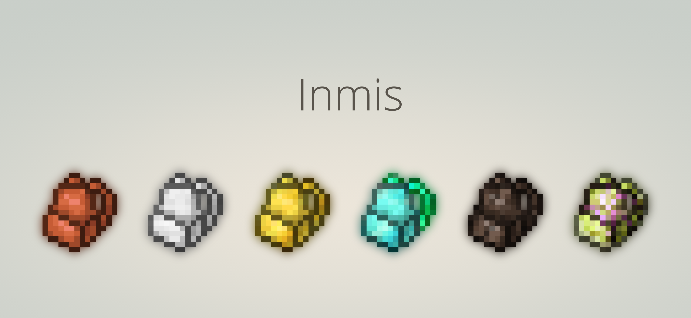
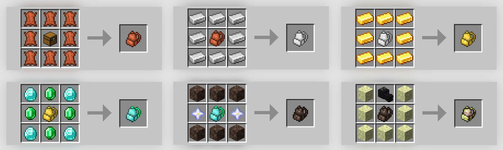

## Inmis

I need more inventory storage... or space. I don't fully remember what the s stands for.

Inmis is a backpack mod! It provides a progression ladder of 6 backpack types, plus 2 extras.

##### Progression tiers:
- Frayed
- Plated
- Gilded
- Bejeweled
- Withered
- Endless

##### Extras:
- Ender Pouch
- Baby Backpack

### Installation

Inmis is a mod built for the [Fabric Loader](https://fabricmc.net/). It requires [Fabric API](https://www.curseforge.com/minecraft/mc-mods/fabric-api) to be installed separately; all other dependencies are installed with the mod. 

### License

Inmis is licensed under the MIT ~~unless I don't like you~~ license. Feel free to utilize the mod and the contents in this repo in your own projects.
